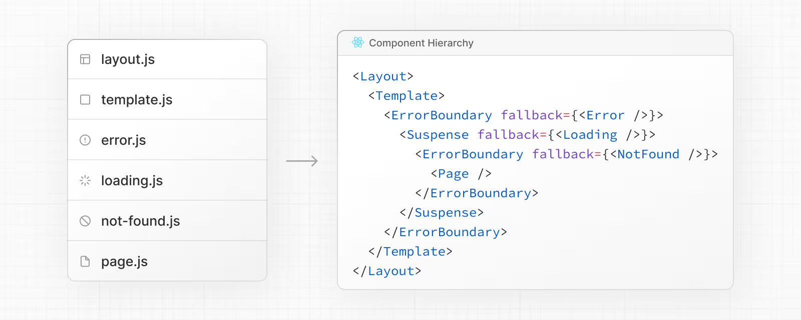
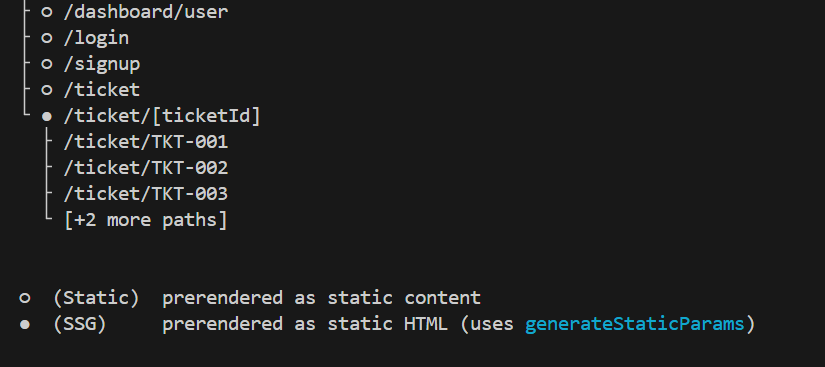

## Next Js learning

- A full stack reactjs library

1. System requirements
- Nodejs > 20.0
- `pnpm create next-app@latest my-app --yes` 
- You can check for manual setup on docs.

2. Check `package.json` file.

2. Next.js uses file-system routing, which means the routes in your application are determined by how you structure your files.

3. Both `layout.tsx` and `page.tsx` will be rendered when the user visits the root of your application (/).

4. Create a `src` folder inside keep your code so that config will be outside for better management.

5. `public` folder will be for handling  static assets.

6. Running dev server
`npm run dev`

7. Set up Absolute Imports and Module Path Aliases
`tsconfig.json`

`
// Before
import { Button } from '../../../components/button'
 
// After
import { Button } from '@/components/button'

`

```
# tsconfig.json

{
  "compilerOptions": {
    "baseUrl": "src/"
  }
}


```

## Project structure and organization

- Top-level files
   = next.config.js
   = src, app, pages, public,
   = proxy.ts

## Nested routes
Folders define URL segments. Nesting folders nests segments. Layouts at any level wrap their child segments. A route becomes public when a page or route file exists.

Path	URL pattern	Notes

app/layout.tsx	     —	    Root layout wraps all routes
app/blog/layout.tsx	 —	    Wraps /blog and descendants
app/page.tsx	     /	    Public route
app/blog/page.tsx	 /blog	Public route
app/blog/authors/page.tsx	/blog/authors	Public route

### Parallel and Intercepted Routes


## Organizing your project

- Next.js is unopinionate about how you oragnize and colocate your project files.

## Components hierarchy

- `layout.js`
- `template.js`
- `error.js` (React error boundary)
- `loading.js`(React suspense boundary)
- `not-found.js`(React boundary for "not found " UI)
- `page.js` or nested    `layout.js`


## Colocation

- In the app director, nested folder  define route structure. Each folder represents a route segment that is mapped to a corresponding segment in a URL path.

- However , even though route structure is defined through folder 


## Layout and pages
- Next.js uses files system routing, meaning you can use folders and files to define routes
- A layout is UI that is shared between multiple pages. On navigation, layouts preserve state, remain interactive, and do not rerender.

-> generating static props
-> route grouping
-> 

## Nesting layouts

## Creating a dynamic segment

- Dynamic segments allow you to create routes that are generated from data. 
- For example, instead of manually creating a route for each individual blog post, you can create a dynamic segment to generate the routes based on blog post data. 
`app/blog/[slug]/page.tsx`

## `function generateStaticParams() {}`
- generateStaticParams() runs at build time
- Build time screenshot
- 



## Linking and navigation
- In next js linking and navigation are hanled by defaults.
- This often means the client has to wait for a server response before a new route can be shown

- Dynamic Rendering vs static rendering


## Prefetching

- Prefetching is the process of loading a route in the background before the user navigates to it.

## Steaming

- Streaming allows the server to send parts of a dynamic route to the client as soon as they're ready, rather than waiting for the entire route to be rendered. This means users see something sooner, even if parts of the page are still loading.

- `Static routes` will only be fetched when the user clicks the link.

- `Dynamic routes` will need to be rendered on the server first before the client can navigate to it.

- `loading.tsx` -> wrap <Suspense> boundary.

## Server and Client Components
- By default all the component in next js are server components
- `use client` directive for client side renering
- When to use what

 -`client component`   when you have onClick, State, events handling, useEffect etc.
 - `server components` when we have to use the server
